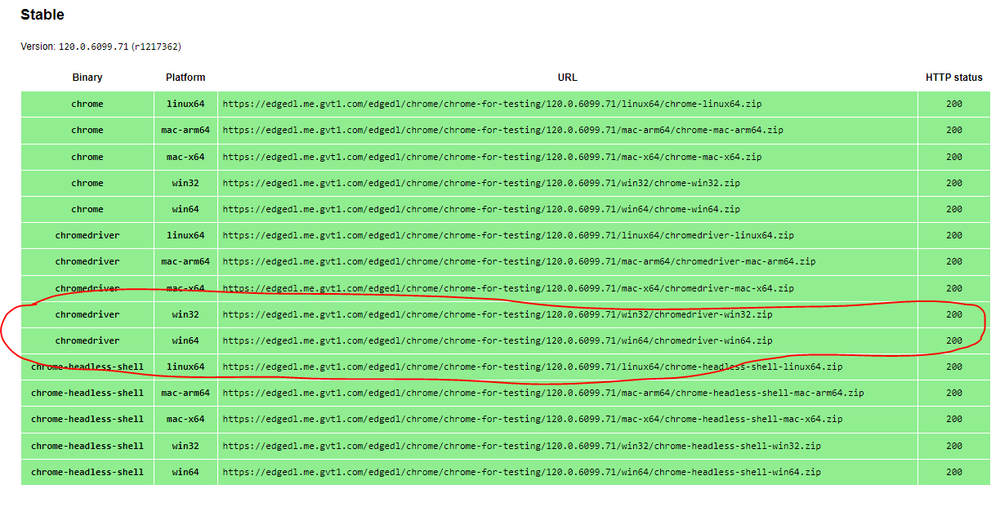
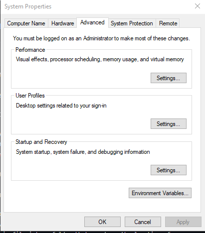
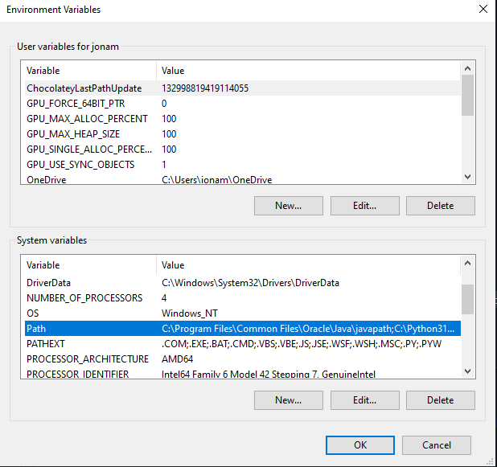
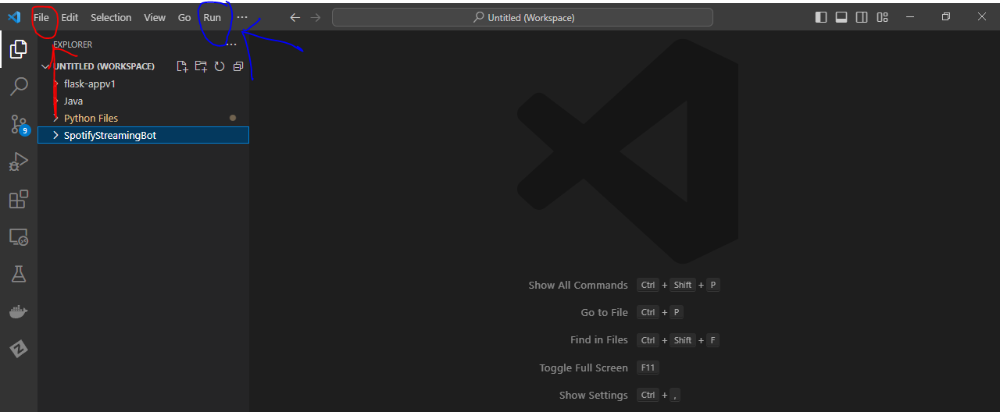
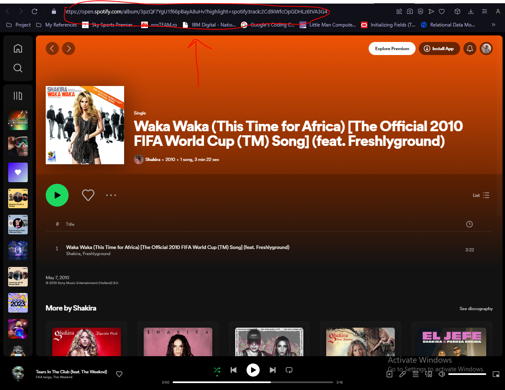
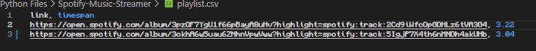

## STEPS FOR RUNNING THE SCRIPT : 

# 1. Install Python:
- Download and install the latest version of python from the official website: [Python](https://www.python.org/downloads/windows/)
- During installation, make sure to check the option that adds Python to the system PATH.

# 2.Install a VSCODE:
- This is the text editor that we will use to edit and run the script
- Download from : [Visual Studio Code](https://code.visualstudio.com/download)

# 3. Install Chrome Browser:
- Download and install the latest version of Chrome from the official website since our script uses chrome: 
- [Chrome](https://www.google.com/chrome/?brand=CHBD&brand=YTUH&gclid=CjwKCAiApuCrBhAuEiwA8VJ6JsWRQZ1zr9OxsR-MMiZe-N27lU6LRHSQy_VTu2j683PYcXyeVPD0LxoCpsQQAvD_BwE&gclsrc=aw.ds)

# 4. Download ChromeDriver:
- Go to [chromedriver](https://googlechromelabs.github.io/chrome-for-testing/) scroll to stable and download the chromedriver ``` win64 zip file / win32``` based on your system.



- Extract the zip file into a folder that you know the location of (you will need this location later).
- Then on windows search ```edit the system environment variables``` and click on it.
- You should get a menu like this : 



- Then click the ```Environment Variables``` button at the bottom.
- Under ```System Variables``` click on ```path``` and press ```edit```.



- Then click on ```browse``` and select the folder that contains the ```chromedriver.exe``` file.

# 5. Installations
- Open Visual Studio Code
- Extract the given ```spotifybot.zip``` file into a folder of your choice.
- To open the project click on File then click add folder to workspace and browse to the folder that contains the files for the bot (circled in red)
- Click on the 3 dots at the top and press ```terminal``` then ```new terminal``` and select the folder with the files (next to the blue circle)


- In the terminal type the following, each at a time waiting until the process is complete to procede :
(These are the libraries that the bot requires)

```bash
pip install selenium
```
```bash
pip install requests
```

# 6. Enter the accounts
- In the ```accounts.txt``` file enter the accounts in the following format : 

***
email:password
***
- No spaces
- Each email:password should be in its own line
- Obviously the more the spotify accounts provided the more the streams

# 7. Enter the playlists
- Go to spotify on the brower and search for the song you want to stream
- The song should be in an album like shown below

- To get the link highlight the song in the album and copy the link in the address bar.
- Each song should be in it's own album like shown in the above image.
- The enter the link and the song play time in the ```playlist.csv``` file as shown below : 


# 8. Run the script
- Run the ```chromedriver.exe``` application
- In the terminal enter 
```python spotify.py```

##### script should run and when done print the link and the song time that has been streamed!
